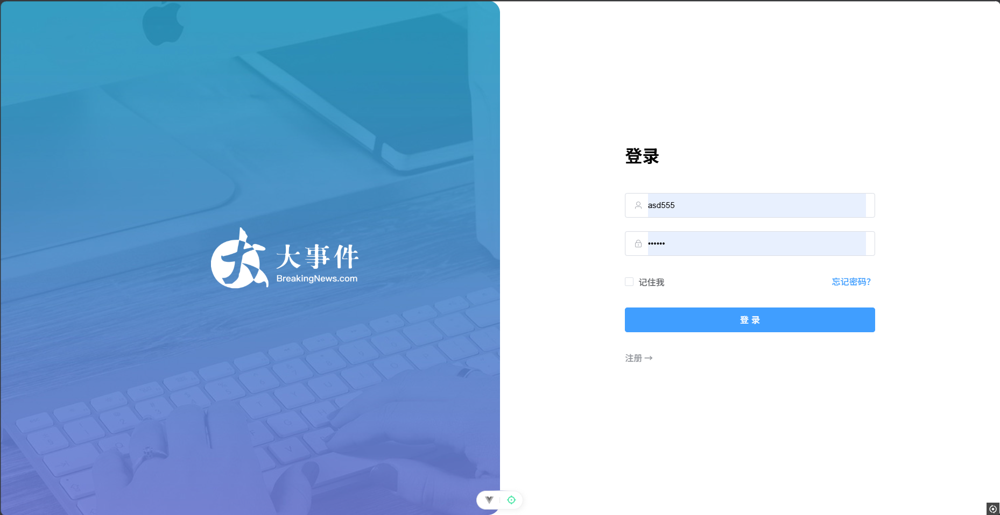
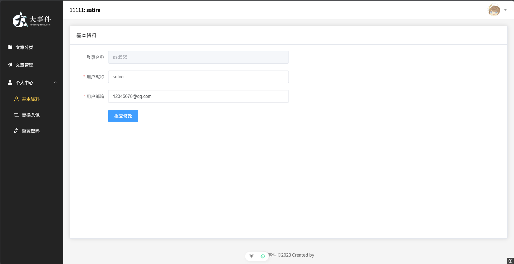

# Vue3 大事件管理后台

## 项目简介

这是一个基于 Vue 3、Element Plus 和 Vite 构建的现代前端管理系统。旨在提供一个高效、美观且易于使用的后台管理界面，用于管理各类数据和内容。

**主要特点：**

- **技术栈先进：** 采用 Vue 3、Pinia 和 Vite 等最新前端技术，提供卓越的开发体验和运行时性能。
- **美观的用户界面：** 基于 Element Plus 组件库，提供一致且专业的界面设计。
- **模块化设计：** 代码结构清晰，易于维护和扩展。
- **响应式布局：** 适应不同屏幕尺寸，提供良好的用户体验。
- **API 交互：** 通过 Axios 库与后端进行数据交互。
- **状态管理：** 使用 Pinia 进行高效的状态管理，并支持状态持久化。

## 功能模块概览

### 登录页面



### 文章管理


### 用户中心



## 技术栈

本项目主要使用了以下技术：

- **核心框架:** Vue 3.x
- **状态管理:** Pinia
- **路由管理:** Vue Router 4.x
- **UI 组件库:** Element Plus
- **HTTP 客户端:** Axios
- **构建工具:** Vite
- **CSS 预处理器:** Sass
- **富文本编辑器:** @vueup/vue-quill
- **代码规范:** ESLint, Prettier, Husky, lint-staged

## 推荐 IDE 设置

[VSCode](https://code.visualstudio.com/) + [Volar](https://marketplace.visualstudio.com/items?itemName=Vue.volar) (并禁用 Vetur)。

## 自定义配置

请参阅 [Vite Configuration Reference](https://vite.dev/config/)。

## 项目设置

```sh
pnpm install
```

### 开发模式运行

```sh
pnpm dev
```

### 生产环境编译和压缩

```sh
pnpm build
```

### 使用 ESLint 进行代码检查

```sh
pnpm lint
```
