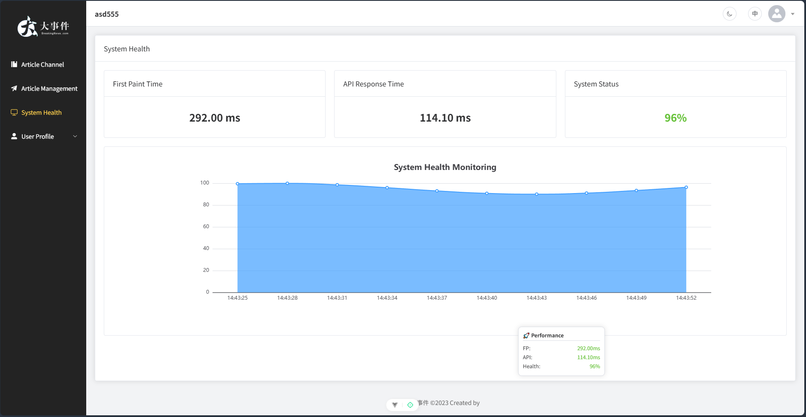
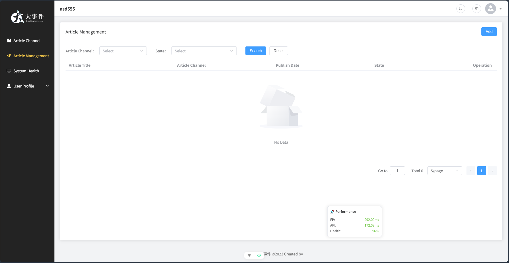
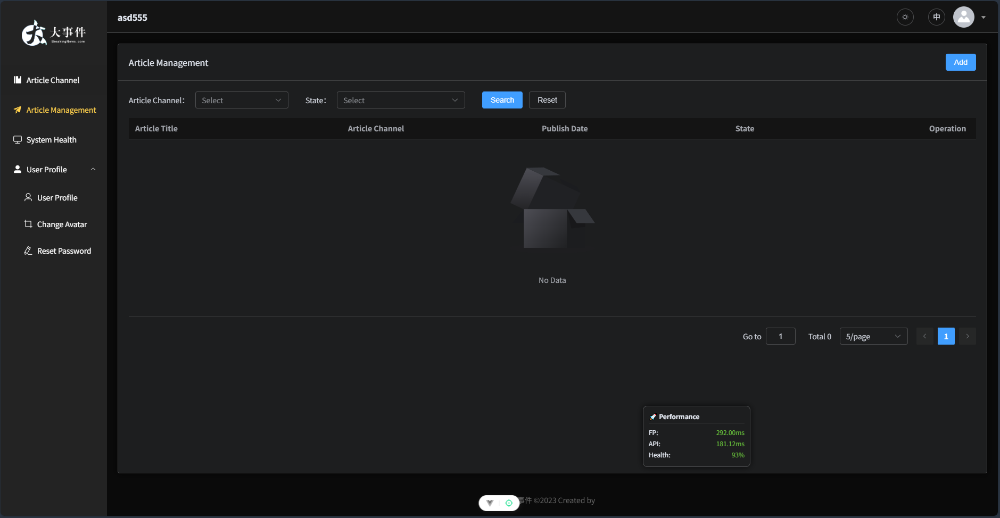
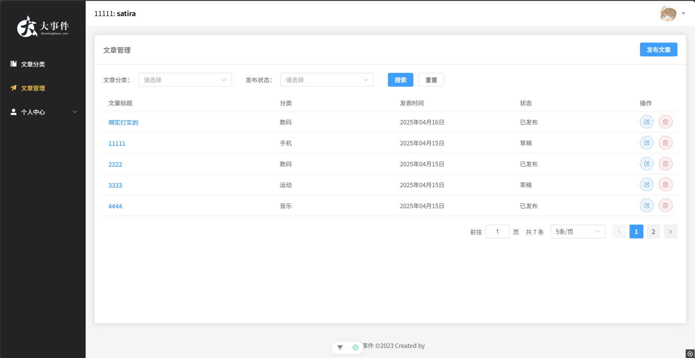
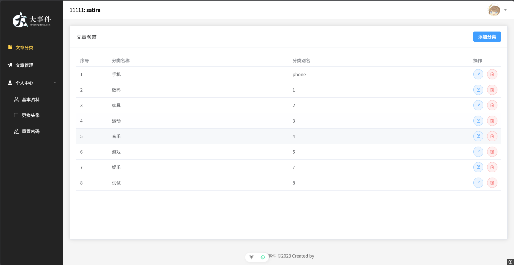

# Vue3 大事件管理后台 (AI 增强版)

## 项目简介

这是一个基于 Vue 3、Element Plus 和 Vite 构建的现代前端管理系统。本项目在基础管理功能之上，引入了 **AI 驱动的性能监控**、**全系统国际化**以及**智能主题切换**等高级特性，旨在提供一个高效、美观且具备工业级监控能力的后台管理界面。

本项目对应的后端是 [练手项目api-server](https://github.com/Arihara-Satoru/api_server)。

**核心亮点：**

- **AI 性能监控：** 内置性能埋点脚本，实时采集 FP/FCP 及接口响应时间，并结合 AI 模拟算法展示系统健康度趋势。
- **可视化仪表盘：** 集成 ECharts，直观展示系统运行状态与健康评分。
- **全系统国际化：** 支持中英文一键切换，涵盖所有业务模块及 Element Plus 组件。
- **智能暗黑模式：** 基于 VueUse 实现极致流畅的暗黑模式切换体验。
- **可拖拽监控组件：** 封装了可自由拖拽的性能监控悬浮窗，方便实时观测。

## 功能模块概览

### 1. 系统健康度监控 (新)

利用 ECharts 展示 AI 模拟的系统健康度变化规律，实时监控首屏加载与接口延迟。


### 2. 国际化与多语言 (新)

支持中英文无缝切换，适配所有按钮、表单及提示信息。


### 3. 暗黑模式 (新)

一键开启暗黑模式，保护视力，提升视觉高级感。


### 4. 基础管理模块

包含文章分类、文章管理、个人中心等核心业务功能。



## AI 性能监控技术细节

该模块实现了从数据采集到智能分析的全链路监控，主要包含以下核心逻辑：

1.  **底层数据采集 (Real-time Tracking)**：

    - 利用浏览器原生的 `PerformanceObserver` API 捕获关键性能指标。
    - **FP (First Paint)**：精确记录浏览器渲染第一个像素的时间点。
    - **FCP (First Contentful Paint)**：记录浏览器渲染出第一段内容（如文本或图像）的时间。
    - **API 响应监控**：自动拦截并记录所有网络请求的耗时，为性能分析提供原始数据支持。

2.  **AI 模拟与健康度算法 (AI Simulation)**：

    - **动态波动模型**：采用正弦函数结合随机噪声算法，模拟真实生产环境下服务器负载的周期性波动规律。
    - **智能评分引擎**：基于实时采集的延迟数据，通过加权算法计算系统健康分（0-100）。当 API 响应时间异常升高时，AI 模型会自动降低健康评分，实现性能预警。

3.  **交互式展示层 (Visualization)**：
    - **可拖拽悬浮窗**：基于 `@vueuse/core` 实现，用户可自由调整监控面板位置，确保不遮挡业务操作。
    - **ECharts 动态趋势**：将历史健康度数据实时绘制成折线图，直观展示系统性能的演变过程。

## 技术栈

本项目采用了最前沿的前端技术栈：

- **核心框架:** Vue 3.3+ (Composition API)
- **状态管理:** Pinia (支持持久化)
- **路由管理:** Vue Router 4.x
- **UI 组件库:** Element Plus
- **可视化引擎:** ECharts 6.x
- **国际化:** Vue I18n 11.x
- **工具库:** @vueuse/core (用于暗黑模式、拖拽等)
- **HTTP 客户端:** Axios
- **构建工具:** Vite
- **CSS 预处理器:** Sass
- **代码规范:** ESLint, Prettier

## 推荐 IDE 设置

[VSCode](https://code.visualstudio.com/) + [Volar](https://marketplace.visualstudio.com/items?itemName=Vue.volar) (并禁用 Vetur)。

## 项目设置

```sh
pnpm install
```

### 开发模式运行

```sh
pnpm dev
```

### 生产环境编译和压缩

```sh
pnpm build
```

### 使用 ESLint 进行代码检查

```sh
pnpm lint
```
